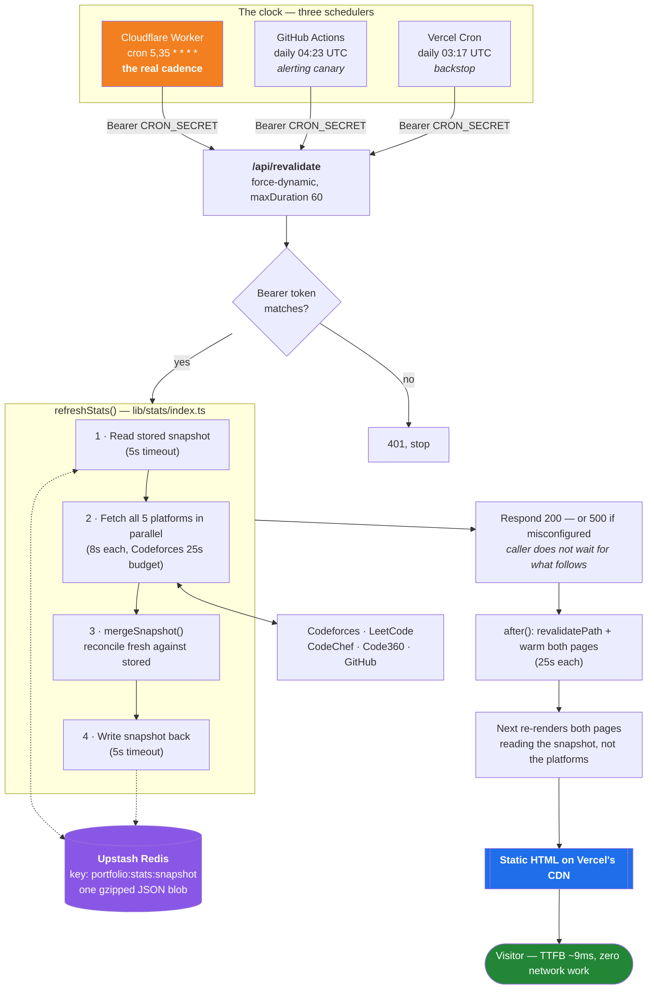

# How this site works

A reference for me, not for visitors. Everything below describes what is
actually deployed, why each piece exists, and what happens when
something breaks.

---

## 1. The one-paragraph version

The portfolio is a Next.js app on Vercel. Both of its pages are
**pre-rendered to static HTML** and served from Vercel's CDN, so a
visitor never waits on a database, a cache, or a coding platform. A
background job — driven by a Cloudflare Worker on a 30-minute cron — is
the *only* thing that ever talks to Codeforces, LeetCode, CodeChef,
Code360 and GitHub. It reconciles whatever answered against a stored
"last-known-good" snapshot in Upstash Redis, saves the result, and
rebuilds the two pages. A platform being down therefore cannot blank a
section, and adding the cache cost visitors nothing.

The whole design exists to satisfy two goals that normally fight each
other: **numbers that are current** and **a page that loads instantly on
a cheap phone**.

---

## 2. The problem this solves

The naive version of a stats page fetches the platforms when someone
visits. That has three failure modes, all of which I hit:

| Problem | What the visitor sees |
| --- | --- |
| A platform is slow | The page hangs until the slowest API answers |
| A platform is down | That section renders blank or zero |
| Traffic arrives | Every visit spends rate limit; you get throttled |

The fix is to **decouple fetching from rendering entirely**. Nothing a
visitor does triggers a fetch. The consequence is that something else
has to do the fetching on a schedule, which is where most of the
complexity below comes from.

---

## 3. The flow



Plain-language version of the same thing:

```
every 30 min   Cloudflare  ──►  /api/revalidate  ──►  read snapshot
                                                 ──►  fetch 5 platforms
                                                 ──►  merge, carrying failures forward
                                                 ──►  save snapshot
                                                 ──►  rebuild both pages
                                                          │
visitor, any time  ────────────────────────────────────►  static HTML from CDN
                                                          (never touches any of the above)
```

**The key line is the last one.** The visitor's path and the refresh path
never meet.

---

## 4. The three schedulers, and why there are three

| | Cloudflare Worker | GitHub Actions | Vercel Cron |
| --- | --- | --- | --- |
| **Schedule** | `5,35 * * * *` (every 30 min) | `23 4 * * *` (daily) | `17 3 * * *` (daily) |
| **Role** | The real cadence | Alerting canary | Backstop |
| **Configured in** | Cloudflare dashboard | `.github/workflows/refresh-stats.yml` | `vercel.json` |
| **Emails on failure?** | No | **Yes** | Dashboard only |
| **Punctual?** | **Yes**, within the minute | No | Yes |

### Why not just one

- **Vercel Cron alone** — the Hobby plan *rejects* any cron firing more
  than once a day. `*/30 * * * *` fails at deploy time, not at runtime.
- **GitHub Actions alone** — this was the original design and it failed.
  Scheduled events were being **dropped, not delayed**: no queued runs
  ever appeared for the missing ticks. Roughly 2 of an expected 14 runs
  fired in a 7-hour window. GitHub documents that `schedule` "can be
  delayed during periods of high load" and offers no guarantee. No
  setting fixes it.
- **A timer inside the app** — impossible. Vercel is serverless; a
  function instance is frozen the moment it returns a response, so
  `setInterval` stops executing. With no traffic there are zero
  instances to hold a timer; with traffic there may be many, each firing
  its own.

So Cloudflare drives the clock (punctual and free), and the daily GitHub
run stays purely to **email me if the endpoint ever returns 500** — which
Cloudflare will not do.

### What if two fire at the same time

Nothing bad. Both read the same stored snapshot, both merge onto it, the
later write wins. The merge is monotonic and append-only, so the loser's
work is simply discarded and **nothing ever regresses**. Cost is one
extra set of API calls, once a day.

---

## 5. Environment variables — where each one lives

| Variable | Vercel | Cloudflare Worker | GitHub secrets | Local `.env.local` |
| --- | :---: | :---: | :---: | :---: |
| `KV_REST_API_URL` | yes | — | — | yes |
| `KV_REST_API_TOKEN` | yes | — | — | yes |
| `CRON_SECRET` | yes (Production only) | yes (as a **secret**) | yes | yes |
| `GITHUB_TOKEN` | yes | — | — | optional |
| `SITE_URL` | — | yes (plain text) | yes | — |

Notes that matter:

- **None are `NEXT_PUBLIC_*`**, so none reach the browser or the client
  bundle. Verified: zero secrets in served HTML or client JS.
- `CRON_SECRET` is **Production-only in Vercel** deliberately, so Preview
  deployments stay openable for testing without knowing the secret.
- The same `CRON_SECRET` string must be identical in Vercel, Cloudflare
  and GitHub. A mismatch means every run silently 401s.
- `GITHUB_TOKEN` is a **fine-grained token with no scopes at all** —
  every endpoint used is public. It only raises the rate limit from
  60/hour to 5,000/hour. Never grant it repo write access.
- `KV_REST_API_*` are what Vercel KV sets; `UPSTASH_REDIS_REST_*` are
  accepted as aliases.

---

## 6. File map

### The data layer — `lib/stats/`

| File | What it does |
| --- | --- |
| `index.ts` | `refreshStats()` (one refresh cycle), `getStats()` (what pages call), `toBundle()`, `liveAchievement()`, `languagesDue()` |
| `store.ts` | Reads/writes the snapshot. Three drivers: Upstash → local file → memory |
| `snapshot.ts` | `mergeSnapshot()` — all the carry-forward and anti-regression rules |
| `snapshot.test.ts` | 28 assertions over the merge rules. `npm run test:stats` |
| `types.ts` | Every shared type **and every timeout/interval constant**, each with its reasoning |
| `activity.ts` | Merges per-day activity across platforms; streaks; heatmap window |
| `codeforces.ts` `leetcode.ts` `codechef.ts` `code360.ts` `github.ts` | One fetcher per platform. Each returns `null` rather than throwing |

### The routes

| File | What it does |
| --- | --- |
| `app/api/revalidate/route.ts` | The refresh endpoint. Auth → refresh → revalidate → warm |
| `app/page.tsx` | Homepage. `force-static`, `revalidate = 1800` |
| `app/stats/page.tsx` | Stats page. Same settings |

### Infrastructure

| File | What it does |
| --- | --- |
| `worker/refresh.js` | Source of the Cloudflare Worker (the live copy is in their dashboard) |
| `worker/wrangler.toml` | Reference copy of the worker's config |
| `worker/README.md` | Deployed settings, how to test, how to change it |
| `.github/workflows/refresh-stats.yml` | Daily canary that emails on failure |
| `vercel.json` | Daily Vercel cron backstop |
| `.env.example` | Every variable, faked, with why it exists |

---

## 7. Edge cases handled

This is the part worth re-reading. Each row is a real failure that was
either hit or deliberately designed around.

### Platform failures

| Case | Handling | Where |
| --- | --- | --- |
| A platform is down | Its previous reading is carried forward and labelled with its real date | `snapshot.ts` |
| A platform *hangs* rather than refusing | Every outbound request is bounded by `AbortSignal.timeout`. **All 11 fetches in the codebase are bounded** — audited after Codeforces stalled 156s and killed a whole refresh | `types.ts`, all fetchers |
| Codeforces accumulates (3 endpoints, 1 req / 2s) | Separate 25s total budget; gives up early and carries forward | `CODEFORCES_BUDGET_MS` |
| A platform returns a *partial* response | Any field that came back empty where we already had a value keeps the old value. Codeforces can return rating history but no rank | `reconcile()` |
| GitHub is rate-limited | `stars`/`forks`/`commits`/`pullRequests`/`issues` are `number \| null`, never `0`. A null hides the figure instead of showing a lie | `types.ts` |
| A platform narrows what it reports | Activity days are **unioned**, never replaced — LeetCode only returns "active" years, so replacing would erase history and make total active days go *down* | `unionDays()` |
| A scrape silently breaks | Counters that can only go up (`solved`, `maxRating`, `totalContributions`, …) refuse to decrease. A wrong number becomes a *stalled* number, which is noticeable | `MONOTONIC` |
| A read comes back with fewer array entries | `history`, `badges`, `topics` are append-only; the fuller version wins | `APPEND_ONLY` |
| A platform stays down for weeks | After **21 days** the reading is dropped and the section says "unavailable" — the page never quietly shows month-old numbers | `STALE_LIMIT_DAYS` |
| Everything fails *and* nothing is stored | `toBundle(emptySnapshot())` — every section already knows how to render "unavailable" | `getStats()` |

### Infrastructure failures

| Case | Handling |
| --- | --- |
| **Upstash credentials missing in production** | The dangerous one — everything *looks* fine but carry-forward silently does nothing. So `/api/revalidate` returns **HTTP 500** when `process.env.VERCEL && driver === "memory"`, which fails the daily GitHub run and emails me |
| A transient Upstash write blip | Returns **200** with `stored: false`. Self-heals next run. Deliberately not an alert — paging every 30 minutes through a blip trains you to ignore alerts |
| Upstash read fails during a page rebuild | Bounded at 5s, returns `null`, treated as first-run. An unbounded read here would hang a *render*, not just a refresh |
| A scheduled tick is missed | No retry, and none needed: the next tick is 30 minutes later and the merge loses nothing |
| The refresh endpoint is called by a stranger | Bearer `CRON_SECRET` required; 401 otherwise |
| Page rebuild is slower than the function limit | Rebuilding both pages measured ~110s, past the 60s ceiling. Moved into `after()` so it runs *after* the response is sent. If cut short, the pages still regenerate on their own via `revalidate = 1800` |
| ISR would serve the first visitor stale HTML | Pages are actively warmed after each refresh rather than waiting for traffic — on a low-traffic site, "the next visitor" is often the *only* visitor |
| Stored snapshot predates a new field | Read defensively (`?? []`) rather than bumping `SNAPSHOT_VERSION`, since a version bump discards *all* carry-forward history |
| Snapshot is half-written or wrong-shaped | `unpack()` validates shape and returns `null` — treated as absent rather than trusted |

### Correctness and presentation

| Case | Handling |
| --- | --- |
| Working on two judges in one day | Days are unioned, not summed. "Active days" means days *worked*, not platform-days |
| Codeforces timestamps near midnight | Bucketed in **IST**, because an active day is a human unit. Under UTC, anything submitted 00:00–05:29 IST would fold into the previous day |
| The heatmap's "today" | Deliberately **UTC**, unlike the above. Every other platform reports UTC days; at 04:00 IST the grid was highlighting a day LeetCode did not think had started. Cannot affect totals — only the current-streak walk and the last cell read it |
| Language percentages are expensive | One request per repo. Refreshed every **6 hours** if exact, retried after **1 hour** if it fell back to the approximation (which put TypeScript at 71% against a real 15%) |
| Rate limit exhaustion from language retries | Unauthenticated, retrying every run would be ~68 requests against a 60/hour ceiling — guaranteeing the approximation stuck forever. The 1-hour retry keeps the total near 49 |
| Homepage and /stats disagreeing | `liveAchievement()` is shared by both, after they once differed by 3 rating points |

---

## 8. Every timeout, and the arithmetic

| Constant | Value | Guards |
| --- | --- | --- |
| `REQUEST_TIMEOUT_MS` | 8s | Any single platform request |
| `CODEFORCES_BUDGET_MS` | 25s | Codeforces' three sequential calls, in total |
| `STORE_TIMEOUT_MS` | 5s | One Upstash read or write |
| `WARM_TIMEOUT_MS` | 25s | Re-rendering one page after a refresh |
| `maxDuration` | 60s | The whole `/api/revalidate` function (Vercel) |
| `STATS_REVALIDATE` | 1800s | ISR floor, so freshness never depends on the cron alone |

**Worst case before the response is sent:**

```
   5s   store read
+ 33s   platform fetches (parallel — Codeforces is the slowest)
+  5s   store write
──────
  43s   against a 60s ceiling. Fits, with headroom.
```

Codeforces is 33s rather than 25s because the budget is a *scheduling*
deadline, not a hard stop: `soft()` refuses to **start** a request past
the 25s mark, but one started just inside it still gets its full 8s
`REQUEST_TIMEOUT_MS`. So 25 + 8. The two unconditional 2.1s rate-limit
pauses fall inside that window, not on top of it.

Page warming is *not* in that budget — it runs inside `after()`, after
the response has already gone out.

---

## 9. Cloudflare specifics

**Free plan limits against actual usage:**

| | Allowance | This worker uses |
| --- | --- | --- |
| Invocations | 100k–200k/day (per the dashboard) | **48/day** — roughly 0.02% |
| CPU time | 10ms per invocation | ~0ms |

**There is no timeout to configure, and that is fine.** Cloudflare bills
**CPU time**, not wall-clock time. Awaiting a `fetch` is idle — the
worker is not computing while it waits. Since this worker does no
computation at all (one fetch, one `console.log`), the 43s worst case
costs essentially nothing against the CPU budget.

The real timeouts that matter are on the Vercel side: `maxDuration = 60`
plus the `AbortSignal` budgets above. Those are what actually bound the
work.

**What Cloudflare will not do:**

- No retries — a failed invocation is skipped, next tick in 30 minutes
- No failure emails — hence the GitHub canary
- No visibility unless you open the Logs / Observability tab

---

## 10. How to verify everything is working

```bash
# 1. Merge rules still hold (28 assertions)
npm run test:stats

# 2. Types and lint
npx tsc --noEmit && npm run lint

# 3. Trigger a refresh by hand and read the report
curl -H "Authorization: Bearer $CRON_SECRET" \
     https://shubham-kumar79.vercel.app/api/revalidate
```

A healthy response looks like:

```json
{
  "ok": true,
  "fresh": ["codeforces", "leetcode", "codechef", "code360", "github"],
  "carriedForward": [],
  "missing": [],
  "stored": true,
  "driver": "upstash",
  "savedAt": "2026-09-06T..."
}
```

**Read it like this:**

| Field | Healthy | Means trouble if… |
| --- | --- | --- |
| `driver` | `"upstash"` | `"memory"` in production — carry-forward is doing nothing |
| `stored` | `true` | `false` repeatedly — Upstash writes are failing |
| `carriedForward` | `[]` | A platform is down. Usually fine; it self-heals |
| `missing` | `[]` | Something has been down past 21 days |
| `ok` | `true` | `false` — read the `error` field |

**Cloudflare:** Workers & Pages → `portfolio-stats-refresh` → **Logs**.
Expect entries roughly 30 minutes apart reading `refresh 200`.

**The site itself:** the "Last updated" line on `/stats`. If it is more
than about an hour old, the clock has stopped.

---

## 11. Performance notes

Because this is the whole point of the architecture:

- Both pages are **static HTML from the CDN**. `x-nextjs-cache: HIT`,
  TTFB ~9ms measured locally.
- The store is read **only during a page rebuild**, never during a
  visitor's request.
- Homepage payload went **97.7 KB → 56.3 KB gzipped (−44%)** by
  replacing the infinite skills marquee, which had to render all 40
  skills *twice* for a seamless loop, and whose brand icons were the
  single heaviest thing on the page.
- The heatmap draws its cells as **5 `<path>` elements**, one per
  intensity level, instead of 371 `<rect>`s. Switching periods went from
  ~306ms to ~2ms.
- The skills section is a **server component** using CSS-only radio tabs,
  so the inlined SVG icon paths never ship a second time in a client
  payload.
- `Stagger` puts **one IntersectionObserver on the container** and drives
  its children through variants — six groups cost six observers, not
  forty.
- Analytics and Speed Insights are 1.5 KB and 4.7 KB gzipped, both
  async, against ~238 KB of page JS.

---

## 12. Things that would break it

Ranked by how likely and how quietly:

1. **`CRON_SECRET` changed in Vercel but not Cloudflare** — every run
   401s silently and the site serves stale data indefinitely.
   *Symptom:* "Last updated" stops advancing. **Nothing emails you.**
2. **Upstash credentials removed from Vercel** — carry-forward silently
   stops. *This one does email you*, via the daily GitHub canary.
3. **Cloudflare worker deleted, or its cron trigger removed** —
   refreshes drop to once a day (the Vercel backstop still fires). Easy
   to miss.
4. **A platform changes its HTML or API shape** — the monotonic guards
   turn this into a *frozen* number rather than a wrong one, which is
   the point, but it still needs a code fix.
5. **`SNAPSHOT_VERSION` bumped** — discards all stored history. Only do
   this deliberately; prefer defensive reads for new fields.

---

## 13. Common changes

| I want to… | Do this |
| --- | --- |
| Change refresh frequency | Cloudflare dashboard → Triggers. Also update `worker/wrangler.toml` and `STATS_REFRESH_SECONDS` |
| Edit the worker code | Edit `worker/refresh.js`, then paste into Cloudflare's editor and Deploy. The sync is manual |
| Add a platform | New fetcher in `lib/stats/`, add its key to `PLATFORM_KEYS`, decide its `MONOTONIC` / `APPEND_ONLY` fields, add a test |
| Change my handles | `content/site.ts` → `handles`. Nothing else hardcodes them |
| Change how long stale data shows | `STALE_LIMIT_DAYS` in `lib/stats/types.ts` |
| Force a refresh now | `curl` the endpoint (§10), or run the GitHub workflow via **Run workflow** |
